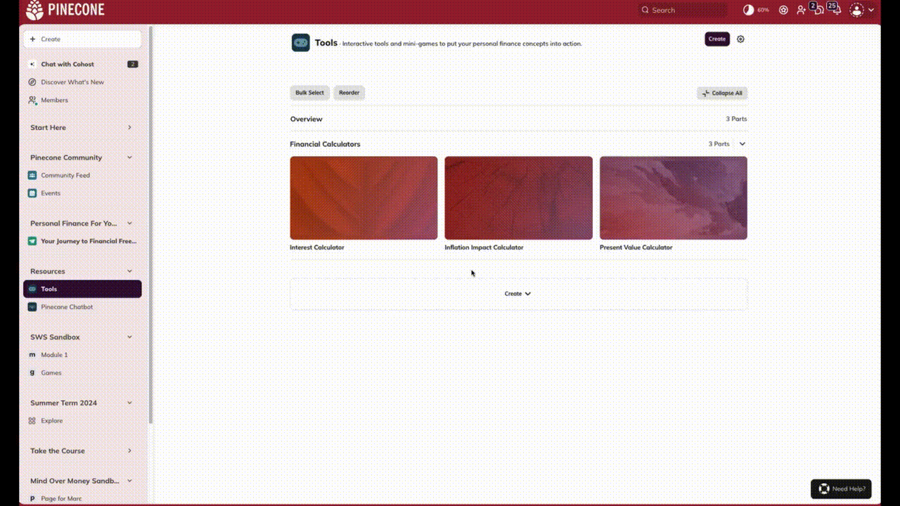

# Instructions for deployment and embedding  

## Deployment

The app deploys to https://ifdm-learning.stanford.edu/ via GitHub Pages. The deploy script will automatically run the build step and generate the static files.

To deploy to GitHub Pages use the following command:
- `yarn deploy`

---

### Embedding a Calculator

Example iFrame:

```angular2html
<iframe src="https://ifdm-learning.stanford.edu/interactives/investment-calculator/"></iframe>
```
See below screencast as an example of embedding the iframe:



## Troubleshooting

### Changes Not Appearing
1. Clear browser cache
2. Check GitHub Pages deployment status
3. Verify the gh-pages branch updated

### iframe Issues
- Ensure the source URL is correct
- Check for CORS restrictions
- Test the iframe URL directly in browser
